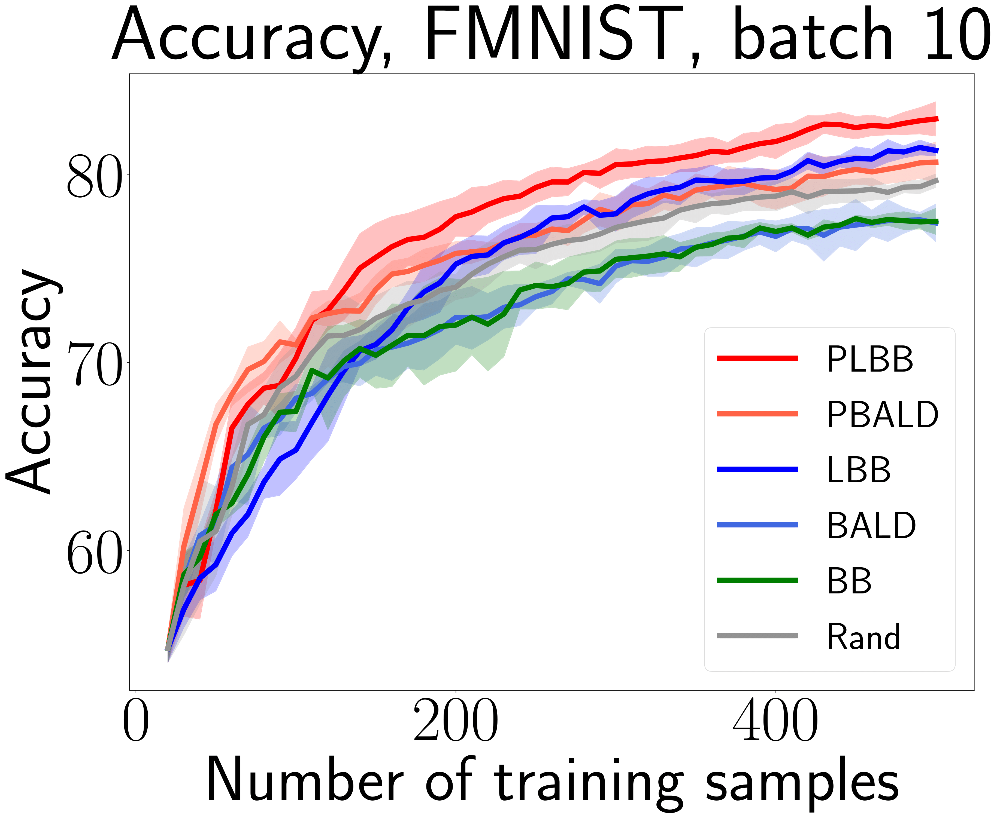

# Scalable Batch Acquisition for Deep Bayesian Active Learning
This is a PyTorch implementation of the [SDM 2023](https://www.siam.org/conferences/cm/conference/sdm23) paper [Scalable Batch Acquisition for Deep Bayesian Active Learning](https://arxiv.org/abs/2301.05490). Our work present a new Bayesian active learning algorithm called Large BatchBALD aka LBB (and its stochastic extension Power Large BatchBALD aka PLBB), which gives a well-grounded approximation to the [BatchBALD](https://arxiv.org/abs/1906.08158) method and aims to achieve comparable quality while being more computationally efficient.

<p align="center"></p>

## Install
`pip install batchbald_redux`

## Train-evaluation examples
FMNIST with MC-dropout:
```sh
python sampling_train.py --dataset_name='FMNIST' --model_name='CNN_MC_RMNIST' --uns_type='MC' --algs PLBB PBALD Rand LBB BALD BB MaxProb --random_seeds 42 227 346 684 920 --acq_batch_size=10 --num_init_samples=20 --max_train_samples=500
```

RCIFAR-100 with deep ensembles:
```sh
python epochs_train.py --dataset='RCIFAR10' --model_name='ResNet-18' --optimizer_name='SGD' --uns_type='ENS' --algs PLBB PBALD Rand LBB BALD MaxProb --random_seeds 42 227 346 684 920 --acq_batch_size=100 --train_batch_size=100 --num_init_samples=2000 --max_train_samples=10000 --num_epochs=50
```

## Experimental setup
All code related to the BALD and BatchBALD algorithms and the corresponding modules are taken from the [**batchbald_redux**](https://github.com/BlackHC/batchbald_redux) repository.
All datasets and implemented algorithms are placed in the `batchbald_redux/` directory. 
Several training options are available: sample-wise training via `sampling_train.py` and regular epoch-wise training via `epochs_train.py`.
Training files are placed in the main directory.
There are also several options for uncertainty estimation: MC-dropout and deep ensembles (available through the training arguments). 

Available active learning algorithms: 
- [BALD](https://arxiv.org/abs/1112.5745)
- [PowerBALD](https://arxiv.org/abs/2101.03552)
- [BatchBALD](https://arxiv.org/abs/1906.08158)
- Large BatchBALD (Ours)
- Power Large BatchBALD (Ours)
- [MaxProb](https://arxiv.org/abs/cmp-lg/9407020)
- Entropy sampling
- Random sampling

Datasets:
- MNIST-based: MNIST, RMNIST, FMNIST, EMNIST, KMNIST
- CIFAR-based: CIFAR-10, CIFAR-100, RCIFAR-10, RCIFAR-100 
- Others: SVHN, AG News (text)

## Citation
```
@article{rubashevskii2023sbadbal,
  title={Scalable Batch Acquisition for Deep Bayesian Active Learning},
  author={Rubashevskii, Aleksandr and Kotova, Daria and Panov, Maxim},
  journal={arXiv preprint arXiv:2301.05490},
  year={2023}
}
```

Big thanks to [**batchbald_redux**](https://github.com/BlackHC/batchbald_redux), our code is partially borrowed from them.
